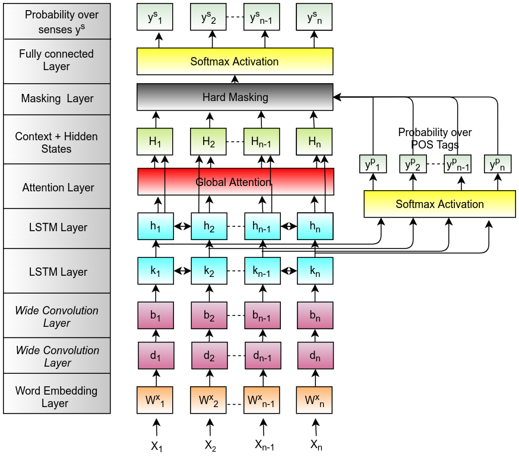
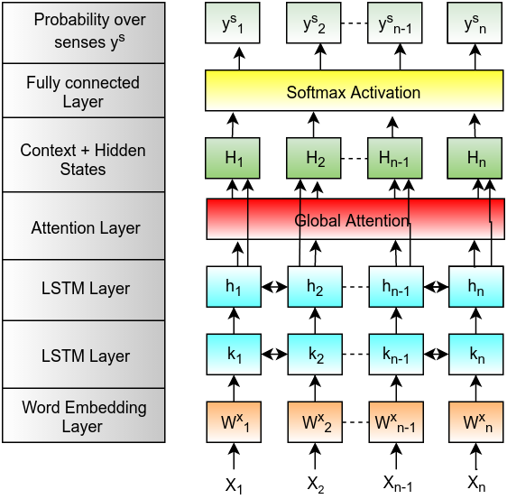
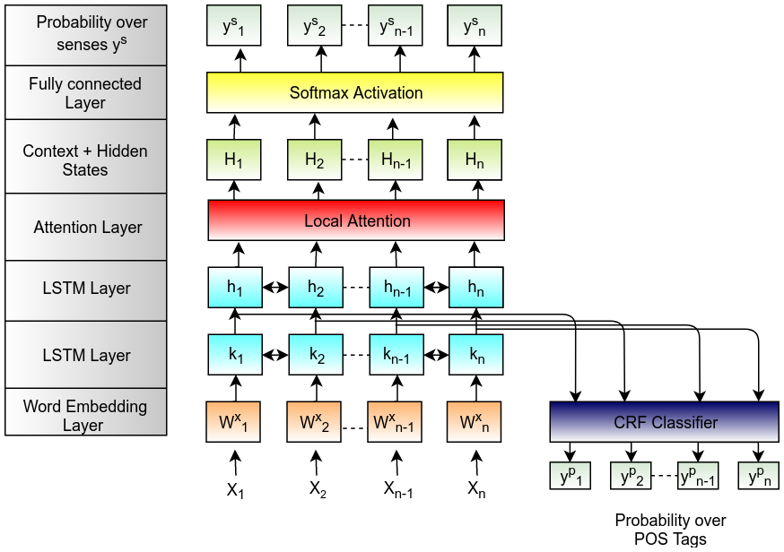
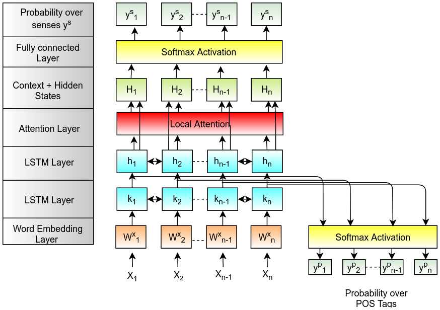
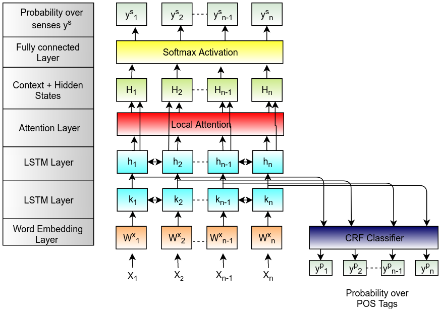
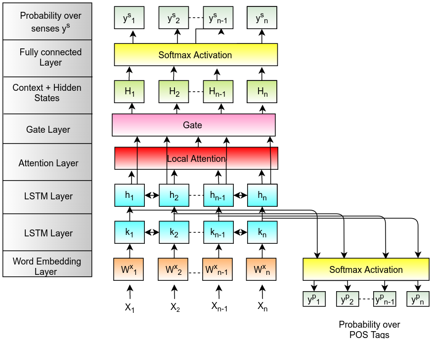
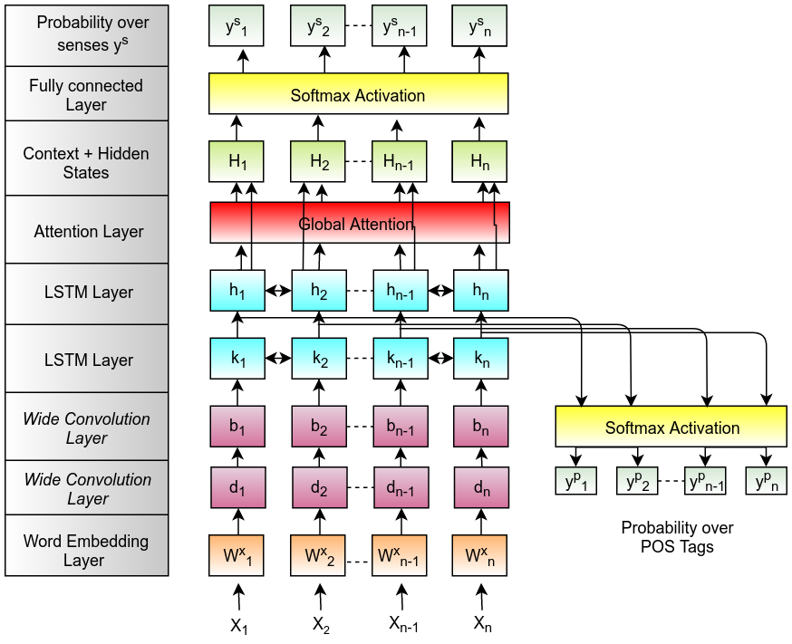
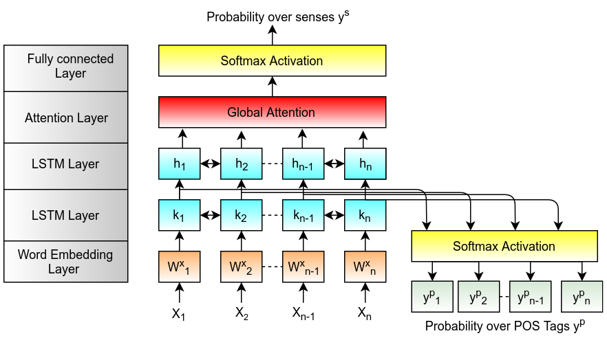
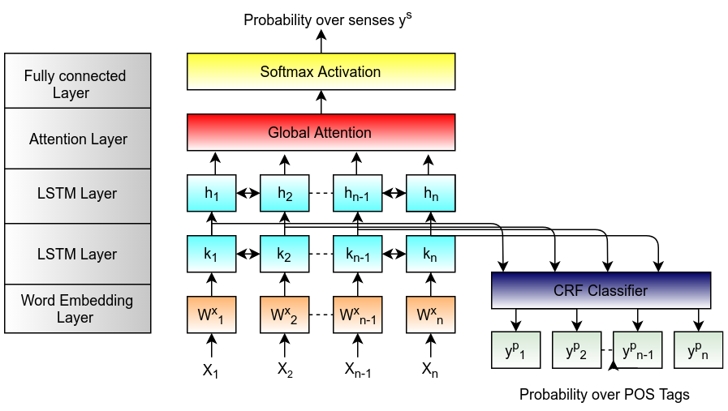
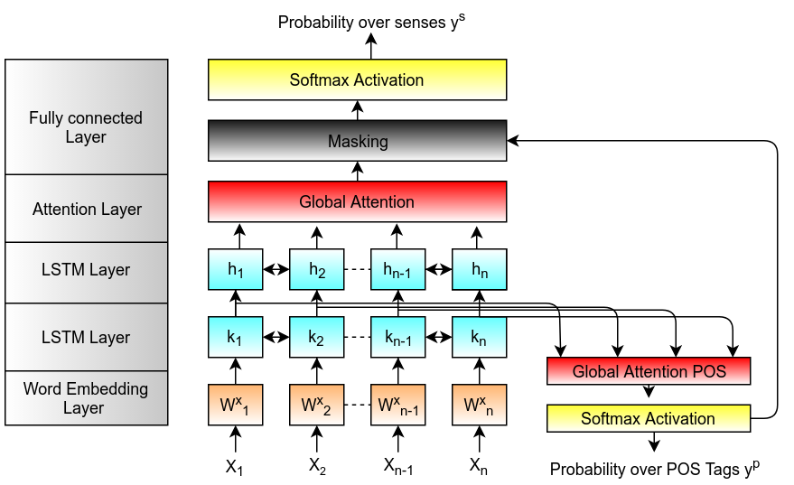

# Word Sense Disambiguation 

Word sense disambiguation (WSD) is the ability to identify the meaning of words in context. We address this problem using series of end-to-end neural architectures using bidirectional Long Short Term Memory (LSTM). We propose two variants for WSD: an end-to-end word specific neural model and all-words neural model. In the word specific models we have to train models for every disambiguation target word. We addressed this issue using the all-words model which rely on sequence learning. We also used POS tags to improve the performance. We tried different variants of attention mechanisms for the all-words model. Performance was boosted by using convolutional neural networks (CNN) which captures local features around the words that is normally what humans do for predicting the senses. We further improved the performance using hierarchical models. We used POS tags as hierarchy and used two variants as soft masking and hard masking.

## Methods

* [Word Specific Model trained on Four Word Dataset](https://github.com/Sshanu/Word-Sense-Disambiguation/tree/master/Four%20Word%20Model)
* [Word Specific Model trained on One Million Dataset](https://github.com/Sshanu/Word-Sense-Disambiguation/tree/master/one_million)
* [All-words Model](https://github.com/Sshanu/Word-Sense-Disambiguation/tree/master/one_million/all-word)
* [Hierarchical Model](https://github.com/Sshanu/Word-Sense-Disambiguation/blob/master/one_million/all-word/Model-aw-lex-hierarchical-2.ipynb)

## Best Models
* [All-words Model+CNN](https://github.com/Sshanu/Word-Sense-Disambiguation/blob/master/one_million/all-word/Model-aw-lex-1.4.ipynb)
* [All-words Hierarchical Model+Soft Masking](https://github.com/Sshanu/Word-Sense-Disambiguation/blob/master/one_million/all-word/Model-aw-lex-hierarchical-2.ipynb)
* [All-words Hierarchical Model+Hard Masking](https://github.com/Sshanu/Word-Sense-Disambiguation/blob/master/one_million/all-word/Model-aw-lex-hierarchical-4.ipynb)

## Details
For detailed information about models and results:
* [Report](https://github.com/Sshanu/Word-Sense-Disambiguation/blob/master/UGP_Report.pdf)
* [Presentation](https://github.com/Sshanu/Word-Sense-Disambiguation/blob/master/UGP_presentation.pdf)

## All words Models

### [All-words Hierarchical Model+Soft Masking](https://github.com/Sshanu/Word-Sense-Disambiguation/blob/master/one_million/all-word/Model-aw-lex-hierarchical-2.ipynb)
 

### [All-words Hierarchical Model+Hard Masking](https://github.com/Sshanu/Word-Sense-Disambiguation/blob/master/one_million/all-word/Model-aw-lex-hierarchical-4.ipynb)
 

### [Basic Model](https://github.com/Sshanu/Word-Sense-Disambiguation/blob/master/one_million/all-word/Model-aw-1-multigpu-1.ipynb)
 

### [Basic Model+Local Attention](https://github.com/Sshanu/Word-Sense-Disambiguation/blob/master/one_million/all-word/Model-aw-lex-local_attention-fast-v2-4.ipynb)
 

### [Basic Model+Local Attentionn+Hidden States](https://github.com/Sshanu/Word-Sense-Disambiguation/blob/master/one_million/all-word/Model-aw-lex-local_attention-fast-v2-6.ipynb)
 

### [Basic Model+Local Attentionn+Hidden States+CRF](https://github.com/Sshanu/Word-Sense-Disambiguation/blob/master/one_million/all-word/Model-aw-lex-local_attention-fast-v3-1.ipynb)
 

### [Basic Model+Gated Attention](https://github.com/Sshanu/Word-Sense-Disambiguation/blob/master/one_million/all-word/Model-aw-lex-local_attention-fast-v2-7.ipynb)
 

### [Basic Model+CNN](https://github.com/Sshanu/Word-Sense-Disambiguation/blob/master/one_million/all-word/Model-aw-lex-1.4.ipynb)
 

## Word Specific Models

### [Basic Model](https://github.com/Sshanu/Word-Sense-Disambiguation/blob/master/one_million/force/Force-Model-1-multigpu-1.ipynb)
Files with name as Model-1-multigpu-1.ipynb are the basic models

### [Basic Model+POS Tags](https://github.com/Sshanu/Word-Sense-Disambiguation/blob/master/one_million/force/Force-Model-2-multigpu-1.ipynb)
Files with name as Model-1-multigpu-2.ipynb are the basic models

### [Basic Model+POS Tags+CRF](https://github.com/Sshanu/Word-Sense-Disambiguation/blob/master/one_million/force/Force-Model-3-multigpu-1.ipynb)
Files with name as Model-1-multigpu-3.ipynb are the basic models

### [Word specific hierarchical model](https://github.com/Sshanu/Word-Sense-Disambiguation/blob/master/one_million/force/Force-Model-4-multigpu-1.ipynb)
Files with name as Model-1-multigpu-4.ipynb are the basic models

